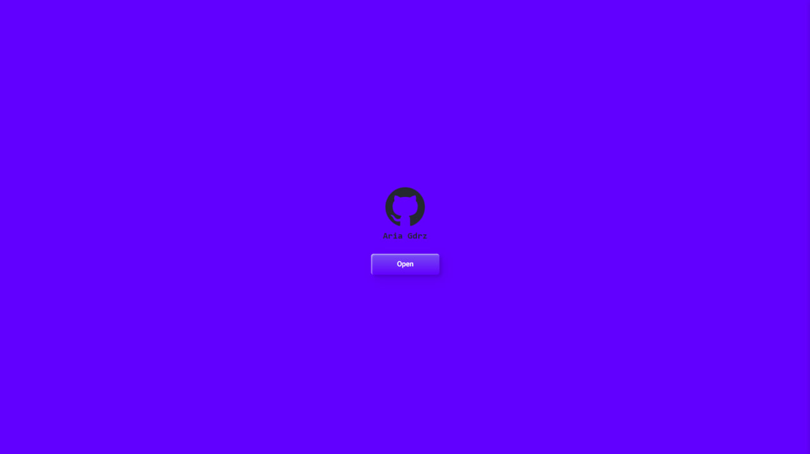
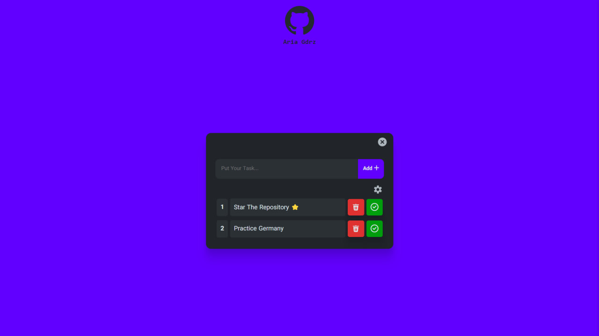
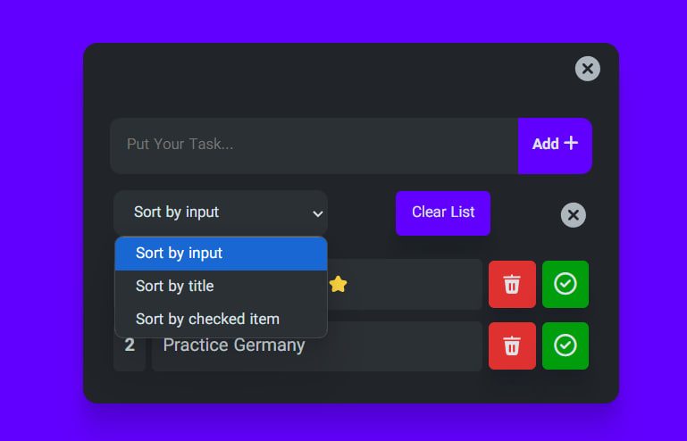
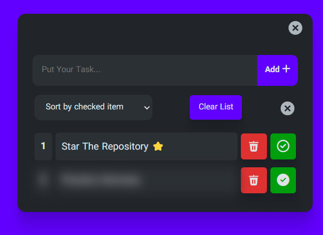
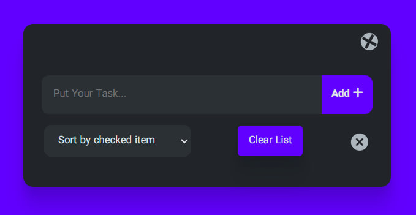

<h1 align='center'><b>📋 ToDo List React App 🚀</b></h1>
<p align='center'>Welcome to the **ToDo List** application built using **React.js**! This simple yet powerful app helps you manage your daily tasks with ease. Stay organized, stay productive! 💪</p>

## 🌟 Features

- ✅ Add tasks effortlessly.
- 📝 Edit and update tasks.
- 🗑️ Delete tasks that are completed or unnecessary.
- ⏳ Mark tasks as pending or completed.
- 📅 Clear all tasks with a single click.

## 🎥 Live Demo

Check out the live demo of the app here: [Live Demo](https://main--todo-list-react-app-ariagdrz.netlify.app/) 🔗

## 📸 Screenshots

Here are some snapshots of the application:








## ⚙️ How to Run the App Locally

### Prerequisites
Ensure you have the following installed:
- [Node.js](https://nodejs.org/) (v14 or later)
- npm (v6 or later)

### Installation Steps
1. Clone this repository:
   ```bash
   git clone https://github.com/ariyagoudarzi/ToDo-List-React-Js-App.git
   ```
2. Navigate to the project directory:
   ```bash
   cd ToDo-List-React-Js-App
   ```
3. Install the required dependencies:
   ```bash
   npm install
   ```
4. Start the application locally:
   ```bash
   npm start
   ```
   The app will be running at [http://localhost:3000](http://localhost:3000).

### Building for Production
To build the app for production:
```bash
npm run build
```
The build artifacts will be stored in the `build/` directory.

## ⭐️ Star the Repo!

If you find this app useful, please consider giving the repository a **star** ⭐️ on GitHub! Your support means a lot. 🌟

## 🛠 Technologies Used

- **React.js** 🖥️
- **CSS** 🎨
- **JavaScript (ES6+)** ⚙️

## 👤 About the Developer

Developed by **Aria Goudarzi**. 
- 📧 For any inquiries or feedback, feel free to reach out via email at: ariagdrz2006@gmail.com 📩

Thank you for using the ToDo List app! Happy tasking! 🎉
